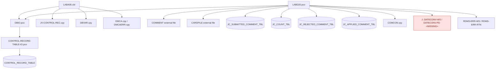
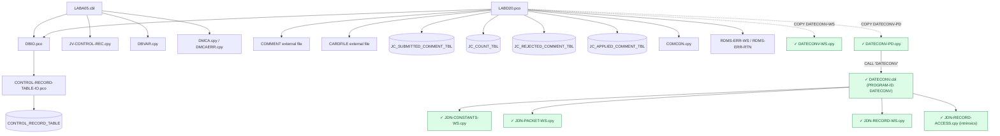

# Initial Dependency Map

## Program-Level Dependencies — Before (initial customer zip)

> ~~`LABD20.pco` references `COPY DATECONV-WS` and `COPY DATECONV-PD`, but those copybooks were absent — the date-conversion subsystem terminates at a red MISSING node.~~

## Program-Level Dependencies — After (2026-05-21 customer follow-up)

The customer follow-up shipment (DATECONV-WS, DATECONV-PD, DATECONV.cbl, JDN-CONSTANTS-WS, JDN-PACKET-WS, JDN-RECORD-WS, JDN-RECORD-ACCESS) closes the dependency graph end-to-end. Every `COPY` and `CALL` from `LABD20.pco` is now resolved.

> ✓ = resolved 2026-05-21. See [`dateconv-function-inventory.md`](./dateconv-function-inventory.md) for the 42-function dispatcher inventory.

## Data Flow Summary

1. `LABD20` reads `CARDFILE` to derive `WS-PROCESS-DATE` from an `MM/DD/CCYY` card date.
2. `LABD20` opens the external `COMMENT` file and reads fixed-layout JV comment records.
3. Each record is validated for date, JV number, section, loan number, comment text, requestor, and approver.
4. Valid records are looked up in `JC_SUBMITTED_COMMENT_TBL` by the 26-character submitted key.
5. Non-duplicate records are inserted into `JC_SUBMITTED_COMMENT_TBL` with program id `LABD20` and the process date.
6. If the in-memory JV counter exceeds the persisted count, `JC_COUNT_TBL` section `MA` is updated.
7. End-of-job stats are queried from submitted, rejected, and applied comment tables.
8. SQL or DMS errors route to rollback/error display logic.

## Conversion Hotspots

- Fixed-width record parsing and COBOL `REDEFINES` must be modeled explicitly.
- ~~Missing `DATECONV-WS` and `DATECONV-PD` copybooks affect date validation fidelity.~~ **Resolved 2026-05-21:** full date-conversion closure supplied (DATECONV-WS, DATECONV-PD, DATECONV.cbl, 4 JDN helpers). Date-validation logic is now reproducible from canonical source. See [`dateconv-function-inventory.md`](./dateconv-function-inventory.md).
- `DBIO` uses file-based Oracle credentials in the legacy environment; modernization must replace this with a managed secret/config mechanism.
- `CONTROL-RECORD-TABLE-IO` has dynamically constructed SQL strings for reads; conversion should prefer parameterized queries.
