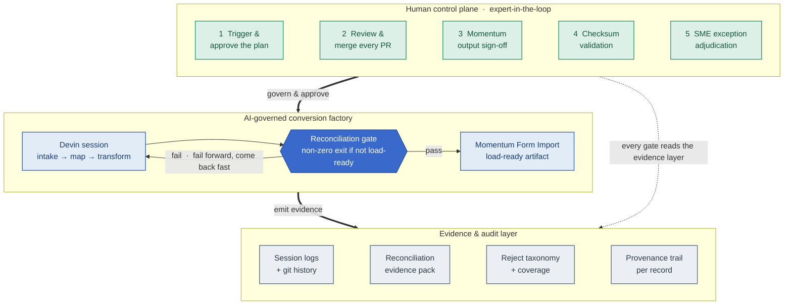
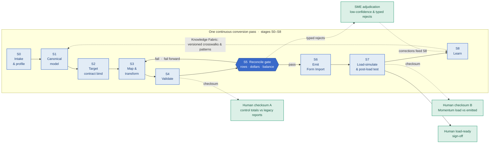
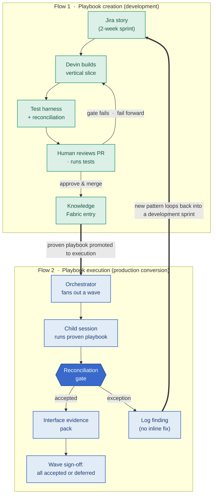
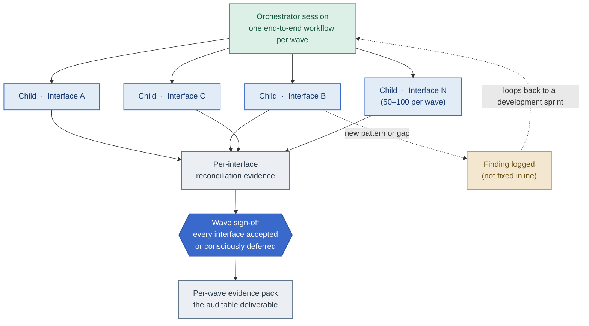

<!-- Co-branded deliverable: Guidehouse + Cognition. In the formatted (.docx/.pdf)
     version, render the cover from the canonical Cognition template
     (COG-GTM/federal_RFP_responses/templates/) with the Guidehouse logo placed
     alongside the Cognition wordmark. This markdown is the content master. -->

# Governance and human control for the VA FMBT Integration & Conversion Factory

### A Guidehouse and Cognition white paper

*Prepared for the Department of Veterans Affairs — Office of Information &
Technology (OIT) and the Financial Services Center (FSC), in support of the
Financial Management Business Transformation (FMBT) program.*

*Guidehouse — program leadership, Momentum subject-matter expertise, business-rule
ownership, and final sign-off. Cognition — Devin, the AI software engineering
platform that generates the interface code, the data-conversion logic, and the
testing evidence under human control.*

> **Second in a series.** This paper is the governance companion to the program's
> executive report ([`factory/executive-report.html`](../factory/executive-report.html))
> and business-level white paper. The executive report makes the case that the
> factory *proves the money survives the trip*; this paper documents the control
> framework that makes that proof **AI-governed and human-controlled** — engineered
> to federal audit standards, not bolted on after the fact.

---

## 1. Executive summary

VA's FMBT program is replacing a three-decade-old financial management system with
**iFAMS**, VA's implementation of **CGI Momentum®**, the FM QSMO-approved federal
core financial platform. The remaining work is delivered wave by wave across the
program's **twelve deployment waves**, and each wave stands up **50–100 interfaces**
(inbound and outbound) and a one-time conversion of the active financial data drawn
from roughly **100 legacy source tables**. Today that work is hand-coded by a
workforce of more than 135 people.

Doing that work with AI-driven automation changes the throughput problem. It also
raises the governance question that every federal financial executive asks first:
*if AI is producing the conversions and the interfaces, who is in control, and how
do I prove it to an auditor?*

This paper answers that question. The factory is **AI-governed, human-controlled**:
the system is AI-powered, but **every consequential action passes through a human
gate**, and the evidence that each step was correct is produced as a first-class
output rather than reconstructed after the fact. The governance model is engineered
so that control does not bottleneck throughput — the gates sit at the **few
checkpoints that actually carry financial and audit risk**, not on every line of
generated code.

The contrast with the program's current posture is deliberate. A waterfall approach
discovers failure late, when it is expensive and hard to unwind. This architecture
makes failure **cheap, visible, and recoverable**: a mapping that is wrong is caught
by an automated reconciliation gate the moment it is produced, logged with a typed
reason, and fixed in the next iteration. We call this **"fail forward, come back
fast"** — the speed of AI automation, with the control rigor federal financial
systems demand.

Three claims anchor the rest of this document, and each is backed by an artifact a
reviewer can open today:

1. **Governance is concrete, not a label.** Control here means a reconciliation gate
   that balances the money to the cent, a per-record provenance trail, role-based
   human review of exceptions, and immutable run logs — not a protocol badge. (See
   §2 and the critique in [`factory/design/AIE-CRITIQUE.md`](../factory/design/AIE-CRITIQUE.md).)
2. **There are five explicit human control points.** No code reaches `main`, and no
   data is declared load-ready, without a named human approving it (§3).
3. **The auditability layer is the deliverable.** Per interface, per wave, the
   program produces row accounting, dollar control totals, a typed reject ledger,
   and a provenance trail — the same evidence an auditor's control test would
   demand (§5, §8).

---

## 2. Governance philosophy — "fail forward, come back fast"

In a waterfall delivery model, validation is a phase near the end. By the time it
runs, the expensive work has already been done on assumptions that may be wrong, and
a defect found at that point is catastrophic: it is late, it is costly, and it often
forces a re-plan. The instinct to treat conversion as the deliverable and testing as
a closing phase is exactly the instinct this architecture inverts.

For a financial conversion, **the reconciliation evidence *is* the deliverable** —
the converted file is just the thing that produces it. So the factory is built
testing-first. Every interface runs the same continuous pass in which mapping,
validation, and reconciliation happen together, and the question *"did the money
survive?"* is answered automatically on every run rather than negotiated in a
meeting. (This is the whole thesis of
[`factory/design/TESTING-AS-THE-PRODUCT.md`](../factory/design/TESTING-AS-THE-PRODUCT.md).)

**The reconciliation gate is the mathematical proof.** The conversion program returns
a non-zero status when a batch is not load-ready — when rows do not account
(`lines_in == lines_loaded + lines_rejected`), when dollar control totals do not tie
to the cent, or when a journal does not balance. A deliberately-unbalanced fixture is
kept in the suite precisely to prove the gate **fails when it should**. That pass/fail
is deterministic and machine-checked; it is not a sign-off ceremony, and it cannot be
talked past. When the gate trips, the finding routes into VA's existing **change
control** process for disposition — the factory's automation produces the evidence;
VA's governance bodies make the call.

> **A note on terminology.** The reconciliation gate is an engineering control *inside
> the factory*. VA itself operates **change control** (a Change Control Board), not an
> automated deploy pipeline, and gate results feed that process. Throughout this paper,
> "gate" means the factory's deterministic correctness check, and "change control" means
> VA's governing process — the two are connected, not conflated.

This is also where we are explicit about what governance *is not*. A tooling or
data-access protocol — the plumbing an agent uses to reach a system — is not a
governance, control, or compliance framework, and presenting it as one will not
survive an ATO or security review. **Governance for a financial conversion is
concrete:** the reconciliation gate (does the money balance?), the per-record
audit/provenance trail, role-based human review of exceptions, and immutable run
logs. The access protocol may be *how* an agent connects to Momentum or a file share;
it is not *why* the conversion is trustworthy. (This is critique #3 in
[`factory/design/AIE-CRITIQUE.md`](../factory/design/AIE-CRITIQUE.md): treating an
access protocol as the governance layer is a category error.)

### The governance architecture at a glance

The shape is the point: AI does the high-volume engineering inside the factory box;
humans hold the gates around it; and the evidence layer captures everything for
audit. Speed and control are not in tension because they operate on different things
— automation on throughput, humans on judgment.

---

## 3. The five human control points

The strength of this model is **expert-in-the-loop**, designed in from the start and
presented as a feature, not a caveat (this is the fix for critique #7 in
[`factory/design/AIE-CRITIQUE.md`](../factory/design/AIE-CRITIQUE.md)). Federal
financial conversion cannot be sold as fully unattended, and shouldn't be. Devin does
the volume; VA and Guidehouse experts hold the decisions. There are five explicit
human control points.

### Control point 1 — A human triggers the playbook

Devin never runs on its own schedule. **A human initiates every session**, selects the
interface to convert, and approves the conversion plan before execution begins. The
orchestrator session does intake, builds the interface inventory, and plans waves, but
it fans out child sessions only when a human has authorized the wave (the orchestration
model is in [`factory/design/FACTORY-DESIGN.md`](../factory/design/FACTORY-DESIGN.md)
§4). There is no standing process that converts production financial data without a
person starting it.

### Control point 2 — A human reviews and merges every pull request

Devin produces code and artifacts as **pull requests**, never as direct writes to the
trunk. Before any merge, two things happen in order:

1. **Devin for Review** runs automated bug, vulnerability, and security checks on the
   diff, surfacing issues before a human spends attention on them.
2. **A human engineer reviews the diff, approves, and merges.**

**No code reaches `main` without human approval.** This is the same disciplined
change-control posture VA already expects of any contractor touching a financial
system — made faster because the machine-checkable issues are caught before review,
not during it.

### Control point 3 — A human reviews Momentum interface outputs (the third gate)

After the factory emits a Momentum-loadable artifact and the **automated reconciliation
gate passes** — rows balance, dollars balance to the cent, every reject is typed — the
output is not simply pushed. A **human subject-matter expert reviews the emitted artifact
against the target contract** (the Momentum Form Import layout / ICD) before sign-off.
This is the **"load-ready" decision**: a person with financial-system judgment confirms
that the artifact is not just internally consistent but correct against what Momentum
will accept. Because Momentum loads through **Form Import** (which applies its own
business-logic validation), the SME is confirming the record will both post *and* be
accepted, not merely that it is well-formed.

### Control point 4 — A human-controlled test phase with checksum validation

The test phase is two-part, and each part has a **checksum (control-total) validation
point that requires human sign-off**:

- **(a) After the initial ETL conversion** — *do the control totals match the legacy
  system's own reports?* Before the data is considered ready to load, a human confirms
  that row counts and dollar totals reconcile against the legacy system's authoritative
  totals. This is the pre-load validation half of the test harness.
- **(b) After form-import execution** — *does the Momentum load match what was emitted?*
  Once Form Import has run, a human confirms the loaded result reconciles against the
  emitted artifact. This is the post-load verification half, where the majority of the
  testing value is realized because it proves the system actually works, not merely that
  data moved.

Both checksum points are human gates. A green machine result is necessary but not
sufficient; a person signs the control totals.

### Control point 5 — Human SME adjudication of exceptions

Not every record maps cleanly, and the factory never pretends otherwise. **Low-confidence
mappings and typed reject categories route to COBOL and finance SMEs** for adjudication.
This is where the two most important test angles do their work:

- **Confidence scoring on every mapping** (test angle #10 in
  [`factory/design/TESTING-AS-THE-PRODUCT.md`](../factory/design/TESTING-AS-THE-PRODUCT.md)):
  a deterministic crosswalk match scores high; an inferred mapping scores low. Low-confidence
  maps are routed to SME review instead of being trusted silently.
- **Audit/provenance trail per record** (test angle #11): every target record can name the
  source byte-row, the rules applied, and the wave/run that produced it — so an SME can trace
  any exception to its origin in seconds.

Crucially, the SME's corrections do not stop at the fix. They **feed back into the Knowledge
Fabric** through the factory's **S8 "learn" loop**, so the next interface and the next wave
start smarter. Human judgment is captured as durable institutional knowledge, not spent once.

---

## 4. Two process flows — development vs. execution

The factory operates in two distinct modes, with deliberately different control
postures. Conflating them is how programs either move too slowly (production-grade
ceremony on exploratory work) or too dangerously (ad-hoc changes on production financial
data). The model keeps them separate.

### Flow 1 — Playbook creation (development phase)

This is where the factory gets **built and refined**, and it runs like a disciplined dev
shop: lighter, iterative, fast-failing. Devin builds the vertical-slice conversion for an
interface (Playbook 01,
[`factory/playbooks/01-vertical-slice-conversion.md`](../factory/playbooks/01-vertical-slice-conversion.md)),
the reconciliation and test harness (Playbook 02,
[`factory/playbooks/02-reconciliation-test-harness.md`](../factory/playbooks/02-reconciliation-test-harness.md)),
and the Knowledge Fabric entries that make the next interface faster.

Human intervention here is the dev-shop kind: a person reviews PRs, runs the test suite,
and checks the reconciliation evidence. The philosophy is **fail forward** — if a mapping
is wrong, the gate catches it, the reject taxonomy logs it with a typed reason, and the
next iteration fixes it. The cost of a wrong guess is one cheap, visible, recoverable
cycle. Work is organized on a **two-week sprint cadence**, with Devin sessions running
inside sprint stories.

### Flow 2 — Playbook execution (execution mode)

This is **production conversion with real financial data**, and the controls tighten
accordingly. The orchestrator (Playbook 03,
[`factory/playbooks/03-interface-wave-fanout.md`](../factory/playbooks/03-interface-wave-fanout.md))
fans out one child session per interface across the interfaces in a wave. **Every child
runs the proven playbook — no ad-hoc changes.** Execution mode is not where the factory
gets redesigned.

The rule that makes this safe: **if an execution reveals a new pattern or gap, it does not
fix it inline.** It logs the finding (a new typed reject category, a coverage regression, a
schema-drift alert) and the fix loops back into a development-phase sprint, where it is built,
reviewed, and proven before it is ever run against production data again. **Wave sign-off
requires every interface to be `accepted` or consciously deferred** with a documented reason,
and the **per-wave reconciliation evidence pack is the auditable deliverable** that VA and
auditors sign before that wave's cutover.

The diagram below shows the discipline that keeps the two modes honest — issues found in
execution loop back to development rather than being patched live:

The heavy dashed-then-bold path is the governance contract: **execution never mutates the
playbook; it feeds development, which re-proves the change before it returns to production.**

Within a wave, execution mode fans out horizontally: one orchestrator session spawns a child
session per interface, each runs the same proven playbook and emits its own reconciliation
evidence, and a single human wave sign-off gates the cutover — any new pattern logged, not
patched live.

---

## 5. The auditability layer

Auditability is not a report generated at the end; it is a property of every step. The
factory produces a continuous, immutable record that lets VA answer any "what happened to
this record?" question in seconds rather than reconstructing it months later.

- **Full session audit trail.** Every Devin session is logged — the prompts that started it,
  the actions it took, the outputs it produced, and the code it changed. The work is observable,
  not opaque.
- **Git history as an immutable record.** Every change is a commit with provenance: author,
  timestamp, diff, and the review that approved it. There is no path to `main` that bypasses
  this record.
- **Reconciliation evidence per interface, per wave.** Row accounting, dollar control totals,
  per-document balance, the typed reject ledger, and mapping-coverage metrics are emitted for
  every interface and rolled up per wave. A worked example runs today in the GL/journal slice
  ([`factory/conversion-datasets/gl-journal-extract/python/reconciliation.py`](../factory/conversion-datasets/gl-journal-extract/python/reconciliation.py)),
  and the per-record provenance is demonstrated in the audit-trail viewer
  ([`factory/demos/audit-trail-viewer/`](../factory/demos/audit-trail-viewer/)).
- **"Request in / request out."** VA can request any artifact or any piece of evidence from any
  point in the pipeline — the source byte-row a target record came from, the rule that flagged a
  reject, the run that produced a wave — **without needing to understand the factory's internals.**
  The evidence is addressable by the questions auditors actually ask.
- **Hooks and sinks.** Session logs, gate results, and reconciliation reports can be pushed to
  VA's preferred monitoring, audit, and documentation infrastructure. The factory does not ask VA
  to adopt a new system of record; it emits into the ones VA already trusts.

The **eleven test angles** in
[`factory/design/TESTING-AS-THE-PRODUCT.md`](../factory/design/TESTING-AS-THE-PRODUCT.md) are the
audit-coverage model — round-trip / reverse reconciliation, cutover-window performance proof,
schema-drift detection, idempotent restart, mapping-coverage as a tracked release gate, the typed
reject taxonomy and trend, fiscal-calendar boundary cases, referential-integrity checks against
Momentum master data, duplicate/replay detection, confidence scoring (#10), and the per-record
provenance trail (#11). Together they are what separate "we converted the data" from "we can stand
behind the conversion in an audit and a cutover window."

---

## 6. Automated analyze sessions (continuous improvement)

The learn loop (S8) is operationalized as a recurring **analyze session** — itself reviewed by a
human, never self-approving.

- **Schedule.** Weekly, aligned to the two-week sprint window (or per-sprint), so improvement
  tracks the program's existing cadence.
- **Trigger.** Cron-based on the sprint clock, or fired after a Devin session completes, so no
  session's lessons are lost.
- **Process.** An automated analyze session reviews the previous session's output against a rubric:
  - **What worked well** — mappings that passed first try; reject categories that decreased.
  - **What failed** — new reject categories, gate failures, coverage regressions.
  - **What is new knowledge** — patterns, edge cases, and SME corrections worth keeping.
- **Human review.** The analyze output is **reviewed by a human** — this is continuous improvement
  under control, not a system that rewrites its own rules unattended.
- **Feedback targets.** Findings feed back into (a) **playbook refinements**, (b) **Knowledge Fabric
  updates** ([`factory/knowledge/`](../factory/knowledge/)), and (c) **reject-taxonomy expansion**
  ([`factory/knowledge/reject-taxonomy.md`](../factory/knowledge/reject-taxonomy.md)). The
  learning-agent demo ([`factory/demos/learning-agent-demo/`](../factory/demos/learning-agent-demo/))
  shows the loop concretely: a reject seen once becomes a recognized, pre-empted pattern on the next run.
- **Ties into sprint reporting.** The analyze output becomes part of the sprint report, so the
  program's improvement is visible to leadership in the artifacts they already read.

This is the mechanism behind the program's efficiency trajectory: the work **compounds** wave over
wave rather than restarting each time, which is what makes a maturing **first-pass success rate** and
a **reduction in manual effort** achievable as a *trend the harness drives toward*, not a day-one promise.

---

## 7. Integration with VA's existing processes

The governance framework is designed to **operate inside VA's existing toolchain** — it asks VA to
adopt no new governance tools.

- **Jira and sprints.** VA already runs Jira and two-week sprints. The factory piggybacks on that
  mechanism rather than replacing it:
  - **Each interface conversion is a Jira story.**
  - **Devin sessions execute within stories** — both development and test-harness execution.
  - **Sprint reports** include interfaces converted, reconciliation evidence, reject trends, coverage
    metrics, and Knowledge Fabric growth — the governance signal arrives in the report leadership
    already reviews.
- **Confluence (or equivalent).** Artifacts produced along the way — sprint reports, knowledge docs,
  findings docs, and per-wave evidence packs — are published to VA's documentation platform, where
  they live as part of the program record.
- **Change control, not CI/CD.** Gate results and failed tests route into VA's existing **Change
  Control Board** process for review and disposition. The factory provides the evidence; VA's governing
  bodies make the decisions, consistent with how the program governs change today.
- **No new tools required.** The governance framework adds discipline and evidence, not a parallel
  system of record. Everything lands in Jira, Confluence, and VA's audit infrastructure.

---

## 8. Governance in the context of federal financial systems

This architecture is built for the standards VA's financial systems are actually held to.

- **A-123 and audit readiness.** OMB Circular **A-123** requires management to establish and assess
  internal controls over financial reporting. The factory's reconciliation gate, typed reject ledger,
  and provenance trail are exactly the kind of control evidence an A-123 assessment looks for — produced
  continuously, per interface and per wave, rather than assembled for an annual review.
- **The reconciliation gate as an auditor's control test.** An auditor's control test asks: *does this
  process reliably prevent and detect error?* The reconciliation gate answers it mathematically on every
  run — row accounting with no silent drops, dollar control totals to the cent using exact decimal
  arithmetic, and per-document balance. The deliberately-failing fixture in the suite is the documented
  proof that the control *detects* error when it occurs.
- **Provenance satisfies traceability.** Test angle #11 — the per-record audit/provenance trail — means
  any finding can be traced from a Momentum record back to its source byte-row, the rules applied, and
  the run that produced it. This is the traceability that closes the audit-finding class around weak
  lineage and undocumented change.
- **Inside VA-approved boundaries.** All processing runs within VA-approved boundaries: agents run as
  secure containerized services with **inference provided entirely inside VAEC using FedRAMP High services
  in Microsoft Azure Government**, with VAEC-hosted retrieval components, and **no external AI endpoints**.
  Artifacts, embeddings, and evidence remain within VA boundary controls, and the factory feeds VA's
  existing interface release and approval pathways rather than bypassing them (see the customer's own
  architecture framing in [`docs/reference/AIE-iFAMS-Modernization-Slicksheet.md`](./reference/AIE-iFAMS-Modernization-Slicksheet.md)).

The remaining production dependencies — the authoritative Momentum Form Import layouts, the USSGL chart
and fund crosswalk, the legacy extract layouts, and the governance sign-off format — are tracked as
answerable customer questions in [`docs/va-fmbt-open-questions.md`](./va-fmbt-open-questions.md), so the
single biggest schedule risk (the target contracts) is foregrounded, not assumed.

---

## 9. Summary — the control matrix

Every gate in one view. The five human control points, the automated gates that feed them, and the
analyze loop that keeps the system improving under supervision.

| Control point | Who | When | What they see | What they approve |
| --- | --- | --- | --- | --- |
| **1. Trigger the playbook** | VA / Guidehouse operator | Before any session runs | The interface, the wave plan, the conversion plan | That the session may start and the plan is sound |
| **2. PR review & merge** | Human engineer (after Devin for Review) | Before any code reaches `main` | The diff, plus automated bug/vuln/security findings | The code change — merge to trunk |
| **3. Load-ready review** | Finance / Momentum SME | After emit + gate pass, before load | The emitted Momentum artifact vs. the target contract/ICD | That the artifact is load-ready against Momentum Form Import |
| **4a. ETL checksum** | Finance SME | After initial ETL conversion | Control totals vs. the legacy system's own reports | That pre-load control totals reconcile |
| **4b. Import checksum** | Finance SME | After Form Import execution | Loaded result vs. the emitted artifact | That the post-load totals match |
| **5. Exception adjudication** | COBOL / finance SME | On every low-confidence map or typed reject | The reject ledger, confidence scores, provenance trail | The correction — which feeds the Knowledge Fabric (S8) |
| **Wave sign-off** | VA / Guidehouse program leadership | Before a wave's cutover | The per-wave reconciliation evidence pack | That the wave may go live (all interfaces `accepted`/deferred) |
| *Automated gate — reconciliation* | *Machine (deterministic)* | *Every run, inline* | *rows balance? dollars balance? rejects typed? load-ready?* | *— (gates input to control points 3, 4, 5; failures route to change control)* |
| *Automated gate — Devin for Review* | *Machine* | *Every PR* | *bug / vulnerability / security findings on the diff* | *— (gates input to control point 2)* |
| *Analyze session* | *Machine, then human review* | *Weekly / per-sprint* | *what worked, what failed, what is new knowledge* | *Human approves findings before they update playbooks/knowledge* |

The matrix is the one-line summary of the whole paper: **AI-governed, human-controlled.** The machine
runs continuously and proves correctness deterministically; humans hold every consequential decision;
and the evidence that each gate was satisfied is produced as the program's deliverable — engineered for
federal audit standards, not retrofitted to them.

---

## About Guidehouse

Guidehouse is a global AI-led professional services firm delivering advisory, technology, and managed
services to the commercial and government sectors. On FMBT, Guidehouse provides program leadership,
Momentum subject-matter expertise, the business design documents and interface inventory, and
business-rule validation and final sign-off.

## About Cognition

Cognition AI is an applied AI company building production-grade AI software engineering systems for
enterprise and government use. Its platform, **Devin**, performs the repetitive engineering work of
interface and data-conversion delivery — generating the code, the conversion logic, and the testing
evidence — under human control, producing the audit trail and reconciliation evidence as first-class
outputs. On FMBT, Cognition supplies the AI-driven generation and the testing harness that make the
governance model in this paper concrete.

---

*This document is the content master for a co-branded Guidehouse + Cognition deliverable. The formatted
(.docx/.pdf) version renders the cover and branding from the canonical Cognition template, with the
Guidehouse logo alongside the Cognition wordmark.*
