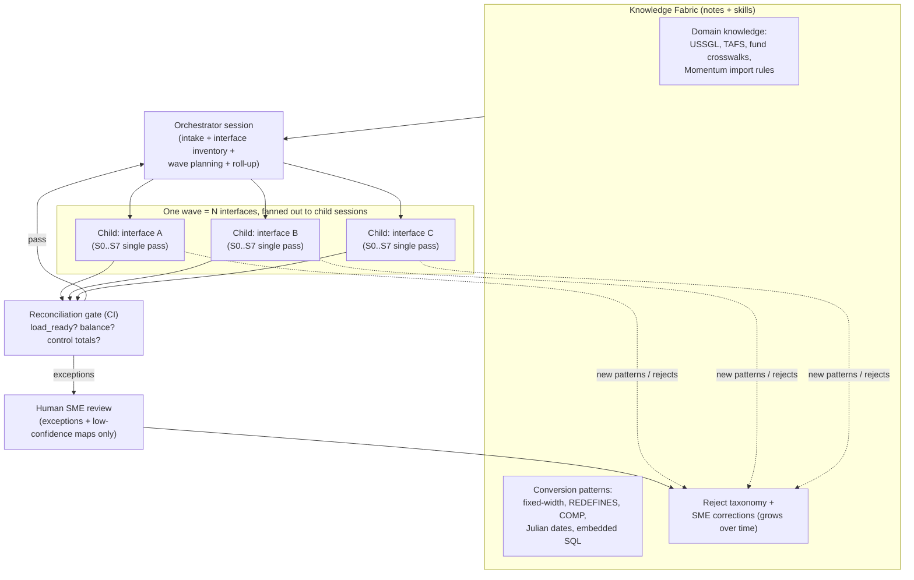

# VA FMBT Integration & Conversion Factory — design

> **Scope of this document.** This is the design for the *net-new* layer
> Guidehouse delivers: an agent-driven factory that converts legacy VA financial
> data and interfaces into CGI's Momentum platform, with validation and
> reconciliation as the primary product. It is **design & documentation only** —
> the factory is run after this plan is approved. The one piece that actually
> runs today is the GL/journal reference slice in
> [`factory/conversion-datasets/gl-journal-extract/`](../conversion-datasets/gl-journal-extract/).

## 1. Where this sits — the three-party split

VA's Financial Management Business Transformation (FMBT) replaces the legacy core
financial system with **iFAMS**, built on **CGI's Momentum® Enterprise Suite** —
the FM QSMO-approved federal core financial management platform
(<https://www.cgi.com/en/momentum>). Three parties own three lanes:

| Party | Lane | What it means for this repo |
| --- | --- | --- |
| **CGI** | The target platform — Momentum SaaS on Azure, and its import/interface contracts. | We integrate *to* Momentum; we don't build it. We need its ICDs (open questions). |
| **CACI** | Rewriting/modernizing the legacy COBOL application code. | The Python port already in `migration/` is our **stand-in for CACI's modernized output** — and proof Devin can ingest and verify someone else's modernized code. |
| **Guidehouse (with Cognition / Devin)** | The **integration & conversion factory** — moving data and interfaces from legacy into Momentum, and proving correctness. | **This is the net-new layer.** It does not exist in the repo yet; this design defines it. |

The reframe matters: nothing in the existing repo is thrown away. The COBOL→Python
work is **repositioned** as the "upstream given," and everything new is the
factory. See [`../../README.md`](../../README.md) for the before/after framing.

## 2. What the factory is, in one paragraph

A legacy VA financial interface (a flat-file extract, an embedded-SQL batch job,
a copybook-defined record feed) goes in one side. Out the other side comes a
**Momentum-loadable artifact plus the reconciliation evidence that the load is
correct** — row accounting, dollar control totals, per-document balance, a reject
ledger with reasons, and a post-load transaction check. The factory is the set of
Devin workflows, playbooks, knowledge, and skills that produce that outcome
repeatably across 110+ interfaces, with humans reviewing exceptions rather than
hand-converting each one.

## 3. The vertical slice — the eight logical stages

Every interface flows through the same eight logical stages. These map onto the
customer's A0–A8 schematic, but we deliberately run them as **one continuous
pass per interface**, not as eight separate agents handing off to each other
(see §5 and [`AIE-CRITIQUE.md`](./AIE-CRITIQUE.md) for why).

| # | Stage | What happens | Where it shows up in the GL slice |
| --- | --- | --- | --- |
| S0 | **Intake & profile** | Ingest the legacy artifact + its copybook/DDL; profile field types, volumes, value distributions, fiscal-period coverage. | `gl_extract.py` parsing + the copybook byte map. |
| S1 | **Canonical model** | Land the legacy record in a normalized, source-tagged intermediate form. | `RawGlLine`. |
| S2 | **Target contract bind** | Bind to the explicit Momentum target contract (the thing tests assert against). | `target/MOMENTUM-JOURNAL-IMPORT.md`. |
| S3 | **Map & transform** | Field mapping, crosswalks (fund/USSGL), unit scaling, date conversion, derived debit/credit. | `mapper.py`. |
| S4 | **Validate** | Contract rules; every failure becomes a typed reject reason, never a silent drop. | `mapper.py` reject reasons. |
| S5 | **Reconcile** | Row accounting, $ control totals, per-document balance, mapping-coverage metric. | `reconciliation.py`. |
| S6 | **Emit** | Produce the loadable target artifact in Momentum's import wire format. | `convert.py` `_to_wire`. |
| S7 | **Load-simulate & post-load test** | Re-read the emitted artifact as an opaque inbound interface; re-assert balance; run post-load transaction checks. | `convert.py` `simulate_momentum_import`. |
| S8 | **Learn** | Feed every reject reason, mapping gap, and SME correction back into the Knowledge Fabric so the next interface starts smarter. | `factory/knowledge/` notes + the reject-reason taxonomy. |

The GL slice runs S0–S7 today and emits the artifacts S8 consumes. The pipeline
ordering is the control-and-data-flow contract: parsing is dumb (S0/S1), judgment
is concentrated in S3/S4, and money is proven in S5/S7. Keeping them separable is
what lets a COBOL SME review *just* the mapping decisions without wading through
parsing or I/O.

## 4. Orchestration model — how Devin actually runs this

The shape, stated plainly:

- **One general Devin workflow runs the whole vertical slice (S0–S7) for one
  interface in a single pass.** No inter-agent handoffs between the eight stages
  — handoffs lose context and add latency without adding correctness.
- **Child agents scale *horizontally* across the 110+ interfaces**, not
  vertically across the eight steps. Each child owns one interface end-to-end.
  This is the parallelism that actually matters at FMBT scale.
- **An orchestrator session** does intake, builds the interface inventory, plans
  waves, fans out child sessions, and rolls up the reconciliation evidence.
- **2–3 playbooks** encode the repeatable procedures (see
  [`../playbooks/`](../playbooks/)): the vertical-slice conversion playbook, the
  reconciliation/test-harness playbook, and the interface-wave fan-out playbook.
- **A Knowledge Fabric** of notes + skills carries domain knowledge (USSGL/TAFS,
  fund crosswalks, Momentum import rules) and a reject taxonomy that grows every
  run (S8). This is how the factory gets *faster and more accurate per wave*.
- **The reconciliation gate is CI.** `convert.py` returns non-zero when a batch
  is not load-ready, so "did the money survive?" is a build status, not a
  meeting.
- **Humans review exceptions only.** SMEs look at rejects and low-confidence
  mappings, not at every line. Their corrections flow back into the fabric.

Net: **1 end-to-end workflow + child-agent fan-out + 2–3 playbooks + a Knowledge
Fabric + a CI reconciliation gate.** Fewer moving parts than an eight-agent mesh,
and it runs faster because the only fan-out is the one that buys throughput.

## 5. Why not mirror their eight micro-agents

Short version (full critique in [`AIE-CRITIQUE.md`](./AIE-CRITIQUE.md)): an
eight-agent mesh where A1 hands to A2 hands to A3 maximizes the number of
context handoffs — and every handoff is where requirements get lost and latency
accrues. The eight stages are real and we honor them as a *checklist within one
pass*; we just don't pay the coordination tax of making each one its own agent.
The parallelism that pays off is across interfaces, because that is where the
work volume is (110+ interfaces × multiple fiscal periods), and those units are
genuinely independent.

## 6. Interface scale & waves

The 110+ interfaces are converted in **waves** aligned to FMBT deployment groups.
Wave planning, the per-interface inventory schema, idempotent re-run behavior,
and schema-drift handling across waves are described in
[`INTERFACE-WAVE-MODEL.md`](./INTERFACE-WAVE-MODEL.md).

## 7. Testing is the product

The factory's differentiator is that validation, reconciliation, and load
rehearsal are the deliverable — not an afterthought bolted on at the end. The
reconciliation engine, the schema/contract tests, the Momentum import simulator,
golden-file regression, the CI gates, and **eleven test angles the customer's
design did not call out** are all in
[`TESTING-AS-THE-PRODUCT.md`](./TESTING-AS-THE-PRODUCT.md).

## 8. What we need from the customer to move from reference to production

The reference slice runs on synthetic data and reconstructed contracts. Going to
production needs real artifacts — the Momentum import ICDs, the authoritative
USSGL chart and fund crosswalk, the legacy extract layouts, and the interface
inventory. These are enumerated as answerable questions in
[`docs/va-fmbt-open-questions.md`](../../docs/va-fmbt-open-questions.md).
