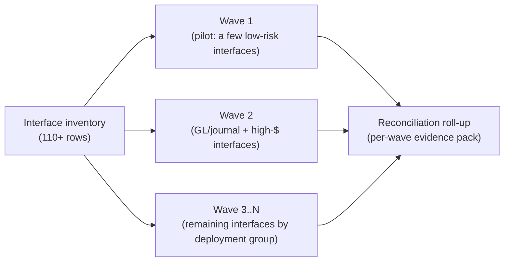

# Interface inventory & wave model

The factory converts **110+ interfaces**, not one. This document describes how
that scale is organized: the per-interface inventory, how interfaces are grouped
into waves, how child sessions fan out, and how re-runs stay safe.

> Interface counts and wave groupings here are planning placeholders until the
> customer supplies the authoritative interface inventory and the FMBT
> deployment-wave schedule (see `docs/va-fmbt-open-questions.md`, Q-INT-1, Q-INT-2).

## Interface inventory schema

Each interface is one row in the inventory the orchestrator builds at intake.
This is the unit of work a single child session owns end-to-end.

| Field | Meaning |
| --- | --- |
| `interface_id` | Stable id, e.g. `GL-JV-001`. |
| `name` | Human name, e.g. "GL journal extract → Momentum journal import". |
| `direction` | `inbound-to-momentum` / `outbound-from-momentum` / `bidirectional`. |
| `source_system` | Legacy system of record (e.g. FMS). |
| `source_layout` | Path/ref to the copybook/DDL/record layout. |
| `target_contract` | Path/ref to the Momentum ICD / import layout. |
| `volume_class` | `low` / `med` / `high` / `year-end-peak` — drives wave packing. |
| `criticality` | Audit/financial criticality — drives review depth. |
| `wave` | Deployment wave it belongs to. |
| `status` | `not-started` / `mapped` / `reconciled` / `load-ready` / `sme-review` / `accepted`. |
| `coverage` | Latest mapping-coverage %. |
| `layout_hash` | Hash of the source layout (drives schema-drift detection). |

The GL/journal reference slice is the worked example of one such row
(`interface_id = GL-JV-001`).

## Waves

Interfaces are converted in **waves aligned to FMBT deployment groups**, not all
at once. A wave is a set of interfaces that go live together for a given
organization/segment. Wave packing balances volume and criticality so a single
wave's child-session fan-out finishes inside the available window.

Each wave produces a **reconciliation evidence pack** — the per-interface
row/$/balance results plus the reject taxonomy — which is the artifact the
customer and auditors sign off on before that wave's cutover.

## Fan-out (horizontal parallelism)

Within a wave, the orchestrator fans out **one child session per interface**.
Each child runs the full S0–S7 vertical slice for its interface and reports its
reconciliation result back. This is the only parallelism in the system, and it
is the one that buys throughput: interfaces are genuinely independent, so N
interfaces convert in roughly the time of the slowest one rather than the sum.

`scripts/create_devin_session.py` is the existing primitive for launching a cloud
Devin session from a prompt file; the wave-fan-out playbook
(`factory/playbooks/03-interface-wave-fanout.md`) describes how the orchestrator
uses it to launch a child per inventory row.

## Re-run safety (idempotency)

Cutover windows get interrupted, and re-runs must be safe:

- **Idempotent emit.** Re-running an interface regenerates a byte-identical
  target artifact for the same input (deterministic ordering, no timestamps in
  the payload), so a golden-file diff stays clean.
- **Exactly-once load posture.** The load step is designed so a re-run of a
  partially loaded batch neither double-posts nor drops — verified by the
  idempotent-restart test angle (#4 in `TESTING-AS-THE-PRODUCT.md`).
- **Resumable waves.** Inventory `status` is the checkpoint; the orchestrator
  resumes a wave by re-fanning only the rows not yet `accepted`.

## Schema-drift across waves

A "stable" interface can change shape between waves (legacy maintenance, new
fields). The `layout_hash` on each inventory row is recomputed at intake; a
changed hash on an interface already converted in an earlier wave raises a
drift alert and forces a re-map + re-test before the new wave proceeds — instead
of silently mis-mapping the drifted field.
