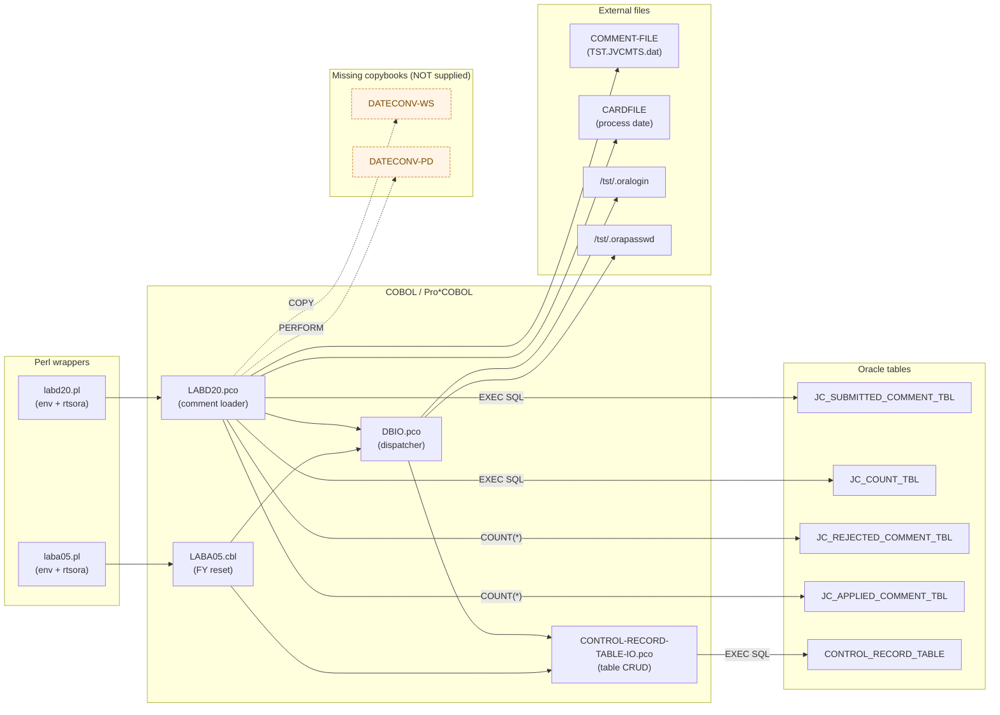
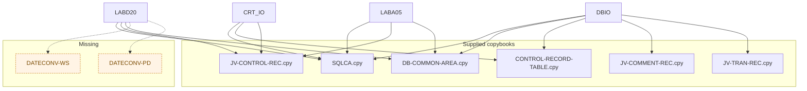
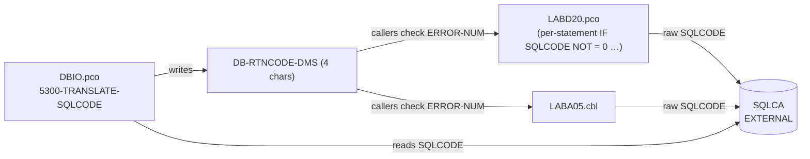

# Detailed dependency map

> **Status:** Demo output, pending SME review.
> See [`migration/ASSUMPTIONS-AND-PLACEHOLDERS.md`](../ASSUMPTIONS-AND-PLACEHOLDERS.md).

This document is a structural map of the supplied COBOL/Pro*COBOL assets and
how they wire together — programs, copybooks, external files, runtime
wrappers, and database objects. It complements
[`analysis/dependency-map.md`](../../analysis/dependency-map.md) (the
baseline) with explicit per-edge citations and a "missing nodes" view.

---

## 1. Program-level dependency graph

### Edge citations

| Edge | Citation |
|------|----------|
| `labd20.pl → LABD20` | `source/perl/` directory wrapper; sets 6+ env vars and calls `rtsora`. See RISKS Risk 10. |
| `LABD20 → DBIO` | LABD20.pco lines that call `'DBIO'` (e.g. `CALL 'DBIO' USING DB-COMMON-AREA`). |
| `LABD20 → DATECONV-WS` | `COPY DATECONV-WS.` at LABD20.pco:182. **Missing.** |
| `LABD20 → DATECONV-PD` | `PERFORM CHECK-CYMD-DT` at LABD20.pco:267 (DATECONV-PD defines CHECK-CYMD-DT). **Missing.** |
| `DBIO → CRT_IO` | DBIO.pco:228-260 dynamic dispatch (`STRING DB-TABLE-NAME DELIMITED BY SPACE '-IO'`). For JV-CONTROL-REC: explicit override at DBIO.pco:267-276 → routes to `CONTROL-RECORD-TABLE-IO`. |
| `DBIO → /tst/.oralogin` | DBIO.pco:33-38 file assignment. RISKS Risk 3 — never reproduce. |
| `LABD20 → COMMENT-FILE` | LABD20.pco:239 (`OPEN INPUT COMMENT-FILE`), :247-253 (READ loop), :215-218 (truncate). |
| `LABD20 → CARDFILE` | LABD20.pco:224-226 (OPEN INPUT / READ / CLOSE). |
| `LABD20 → JC_SUBMITTED_COMMENT_TBL` | LABD20.pco:325-330 (SELECT), :352-372 (INSERT), :421-423 (COUNT). |
| `LABD20 → JC_COUNT_TBL` | LABD20.pco:398-401 (UPDATE). |
| `LABD20 → JC_REJECTED_COMMENT_TBL` | LABD20.pco:431-433 (COUNT only). |
| `LABD20 → JC_APPLIED_COMMENT_TBL` | LABD20.pco:441-443 (COUNT only). |
| `CRT_IO → CONTROL_RECORD_TABLE` | All SELECT/INSERT/UPDATE/DELETE sections of CONTROL-RECORD-TABLE-IO.pco. |
| `LABA05 → CRT_IO` (via DBIO) | LABA05.cbl:152-205 (FETCH-CTRL-REC, MODIFY-CTRL-REC) → DBIO override at DBIO.pco:267-276. |

---

## 2. Copybook dependency graph

> The supplied copybooks are listed verbatim from `source/copybooks/`.
> Missing-node detection is mechanical: any `COPY <name>.` that has no
> matching file under `source/copybooks/` is flagged.

---

## 3. SQLCA / SQLCODE flow across modules

- `SQLCA` is shared via Pro\*COBOL `EXEC SQL INCLUDE SQLCA END-EXEC.`
- `SQLCODE` is the global, last-statement Oracle return code.
- DBIO maps SQLCODE → 4-char DMS code (DBIO.pco:374-398, see RISKS Risk 6).
- Callers (LABA05, LABD20) inspect the **DMS** code (`DB-RTNCODE-DMS`), not
  raw SQLCODE — modernization must preserve this.

---

## 4. Environment-variable / runtime dependencies (Perl wrappers)

From `source/perl/` (typical pattern; each wrapper differs slightly):

| Env var | Used by | Purpose |
|---------|---------|---------|
| `ORACLE_HOME` | `rtsora` | Oracle client home |
| `ORACLE_SID` | `rtsora` | Oracle SID |
| `TWO_TASK` | `rtsora` | Net Service Name |
| `RTSORA_LIB` (or similar) | `rtsora` | Run-time linker path for Pro*COBOL |
| `LD_LIBRARY_PATH` | shell + rtsora | Shared lib lookup |
| `PATH` | shell | Tool resolution |
| `JV_CMT_DIR` (or similar) | LABD20 | Location of COMMENT-FILE / CARDFILE |
| credential files | DBIO | `/tst/.oralogin`, `/tst/.orapasswd` (RISKS Risk 3) |

> The exact env-var list varies per wrapper. Modernization should replace
> all of these with explicit configuration objects + a secrets store
> (no on-disk credential files). See `migration/converted-code/python/db_dispatcher.py`
> for the modernized pattern.

---

## 5. DBIO dynamic-dispatch resolution table

DBIO.pco constructs IO-module names at runtime by concatenating
`DB-TABLE-NAME` with `'-IO'` (DBIO.pco:228-260). The supplied modules
indicate the following resolution table:

| `DB-TABLE-NAME` | Resolves to | Source | Notes |
|-----------------|-------------|--------|-------|
| `CONTROL-RECORD-TABLE` | `CONTROL-RECORD-TABLE-IO` | DBIO.pco:267-276 (explicit override for JV-CONTROL-REC) | Supplied. |
| `JV-COMMENT-REC` | `JV-COMMENT-REC-IO` | DBIO.pco:367 (5200-EVALUATE-TABLE) | **Not supplied** — referenced only by `MOVE DB-CONSTRAINT TO JV-COMMENT-REC`. |
| `JV-TRAN-REC` | `JV-TRAN-REC-IO` | DBIO.pco:369 | **Not supplied** — same pattern as above. |
| anything else | string-built name | DBIO.pco:228-260 | **Untraceable from supplied source.** |

> **Modernization stance:** the dynamic-string path is replaced by a typed
> `DBDispatcher` class with named methods (see RISKS Risk 4 + ASSUMPTIONS A-9).
> Each table that the legacy site reached via the dispatcher must be enumerated
> explicitly during SME review; any string-only path is unsupported.

---

## 6. Missing-node summary

| Missing node | Referenced by | Severity | Mitigation |
|--------------|---------------|----------|------------|
| `DATECONV-WS` (copybook) | LABD20.pco:182 (COPY) | HIGH — affects date validation correctness | Stub in `labd20_loader.check_cymd_dt` with Gregorian-calendar check; `# PLACEHOLDER` marker. |
| `DATECONV-PD` (copybook) | LABD20.pco:267 (PERFORM CHECK-CYMD-DT) | HIGH | Same as above. |
| `JV-COMMENT-REC-IO` (module) | DBIO.pco:367 | MEDIUM — out of scope for current programs | Not exercised by LABD20/LABA05 paths; flag for SME confirmation. |
| `JV-TRAN-REC-IO` (module) | DBIO.pco:369 | MEDIUM | Same. |
| Source of `WS-JV-COUNTERS` | LABD20.pco:393 | MEDIUM | Inferred = current `JC_COUNT_NUM` for section 'MA'. |
| Inserts into `JC_REJECTED_COMMENT_TBL` / `JC_APPLIED_COMMENT_TBL` | Only `COUNT(*)` references in supplied source | LOW — only reporting affected | Flag for SME confirmation. |
