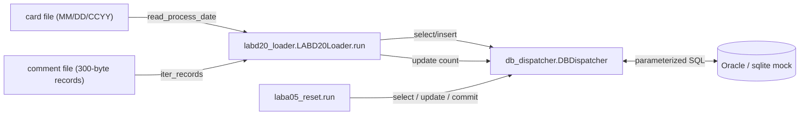

# Post-modernization documentation

> **Status:** Demo output, pending SME review.
> This is the artifact that answers Jill's question 1 directly: documentation
> generated *from the modernized Python*, not from the legacy COBOL. Every
> citation in this file points into `migration/converted-code/python/`.

---

## 1. System overview

The modernized JV processing system has three Python modules and a
parameterized SQL bundle:

| Module | Role | File |
|--------|------|------|
| `db_dispatcher` | Connection lifecycle, transaction control, SQLCODE→DMS translation, demo-schema DDL. | [`db_dispatcher.py`](../converted-code/python/db_dispatcher.py) |
| `labd20_loader` | Daily comment ingestion (analog of LABD20). | [`labd20_loader.py`](../converted-code/python/labd20_loader.py) |
| `laba05_reset` | Fiscal-year JV-NUMBER reset (analog of LABA05). | [`laba05_reset.py`](../converted-code/python/laba05_reset.py) |
| `demo_app` | Runnable end-to-end (CLI + HTML dashboard). | [`demo_app.py`](../converted-code/python/demo_app.py) |
| SQL bundle | Parameterized DML for the loader + control-record CRUD. | [`labd20_operations.sql`](../converted-code/sql/labd20_operations.sql), [`control_record_table_operations.sql`](../converted-code/sql/control_record_table_operations.sql) |

---

## 2. Data flow (post-modernization)

All persistence flows through the dispatcher; programs do not open their own
DB connection, which simplifies secrets handling and transaction control.

---

## 3. API reference — generated from the Python source

### 3.1 `db_dispatcher`

| Symbol | Source line | Purpose |
|--------|-------------|---------|
| `DBDispatcher.from_env(env=None)` | `db_dispatcher.py` classmethod | Build a dispatcher from `JV_DB_DSN` / `JV_DB_USER` / `JV_DB_PASSWORD` (no on-disk credentials). |
| `DBDispatcher.connect(conn)` | constructor | Adopt an existing PEP-249 connection (sqlite3 or oracledb). |
| `DBDispatcher.commit() / rollback()` | transaction helpers | Wrap commit/rollback with structured logging. |
| `DBDispatcher.execute(sql, params)` | low-level | Returns rowcount; raises on error. |
| `DBDispatcher.fetch_one(sql, params)` | helper | Returns the first row or `None`. |
| `DBDispatcher.insert / update / delete` | high-level | Parameterized DML helpers. |
| `translate_sqlcode(sqlcode, *, set_name="", function_type="")` | module-level | Reproduces `5300-TRANSLATE-SQLCODE` from DBIO.pco:374-398. Returns a 4-character DMS code. |
| `DEMO_SCHEMA_DDL` | module-level | 5 CREATE TABLE statements for the in-memory mock DB. |
| `build_demo_schema(dispatcher)` | helper | Apply the demo schema to a fresh in-memory connection. |
| `seed_control_record(dispatcher, jv_number)` | helper | Insert a CONTROL_RECORD_TABLE row with a 400-byte payload. |

### 3.2 `labd20_loader`

| Symbol | Source line | Purpose |
|--------|-------------|---------|
| `LoaderConfig(card_path, comment_path, truncate_after_processing=True)` | dataclass | Immutable config. |
| `LoaderStats` | dataclass | Run results: counts, rejection reasons, process date. |
| `CommentRecord` | dataclass | Parsed 300-byte record with byte-slice fields. |
| `parse_comment_record(raw)` | top-level | Parse a single 300-byte record. |
| `iter_records(path)` | generator | Yield `CommentRecord` objects from a fixed-width file. |
| `read_process_date(path)` | top-level | Read the card file (MM/DD/CCYY → YYYYMMDD). |
| `check_cymd_dt(yyyymmdd)` | top-level | ~~Gregorian-calendar stub. **`# PLACEHOLDER` for `DATECONV-PD`.**~~ **Resolved 2026-05-21:** delegates to faithful port at `migration/converted-code/python/dateconv.py`; GnuCOBOL byte-for-byte parity verified. |
| `determine_disposition(record)` | top-level | Apply LABD20 validation rules; returns `(is_valid, reasons)`. |
| `LABD20Loader(dispatcher)` | class | Bundle dispatcher + run lifecycle. |
| `LABD20Loader.run(config)` | method | End-to-end: read card → iterate records → validate → dedupe → insert → post-process → commit → stats. |
| `truncate_file(path)` | helper | Truncate the comment file (legacy OPEN OUTPUT / CLOSE pattern). |

### 3.3 `laba05_reset`

| Symbol | Source line | Purpose |
|--------|-------------|---------|
| `ResetOutcome` | dataclass | `return_code` (0 or 99), before/after JV numbers, message. |
| `_extract_jv_number(data)` | helper | Decode JV-NUMBER from bytes 24-30 of CONTROL_RECORD_DATA. **`# PLACEHOLDER` for production `struct.unpack`.** |
| `_replace_jv_number(data, new_value)` | helper | Write a new JV-NUMBER back to bytes 24-30. |
| `run(dispatcher)` | top-level | End-to-end reset: select → display → reset → update → commit. Returns `ResetOutcome`. |

### 3.4 `demo_app`

| Symbol | Purpose |
|--------|---------|
| `cmd_run` | Seed mock DB + run LABA05 + LABD20; print structured report (or JSON with `--json`). |
| `cmd_serve` | Same as `run`, plus serve an HTML dashboard at `http://127.0.0.1:8765`. |
| `_run_full_demo` | Build a fresh in-memory mock + run the full flow; return a JSON-friendly dict. |

---

## 4. Deployment notes

| Topic | Recommendation | Source |
|-------|----------------|--------|
| Secrets | Use a managed secrets store (e.g., AWS Secrets Manager, HashiCorp Vault, Kubernetes Secret) and inject `JV_DB_DSN` / `JV_DB_USER` / `JV_DB_PASSWORD` as env vars. **Never** reproduce the `/tst/.oralogin` / `/tst/.orapasswd` file pattern. | RISKS Risk 3; `db_dispatcher.DBDispatcher.from_env`. |
| Database driver | `oracledb` (thick or thin mode depending on operational requirements). Demo uses `sqlite3` in-memory for zero-setup. | ASSUMPTIONS A-1. |
| Orchestration | Replace the Perl wrapper layer with Airflow DAG / Kubernetes CronJob / AWS Step Functions; the loader and reset are idempotent on their respective input contracts. | RISKS Risk 10. |
| File hand-off | Continue to consume the same fixed-width comment file and card file (post-modernization compatibility). | Demo wiring in `demo_app.py`. |
| Logging | Loader emits structured INFO logs; stats are emitted via `LoaderStats.format_report()`. Configure central log shipping per federal requirements. | `labd20_loader.LABD20Loader._log_report`. |
| Error handling | Any non-zero SQLCODE → ROLLBACK + `return_code=99` (same envelope as legacy `9999-ROLL-BACK`). | `labd20_loader.LABD20Loader._fatal_rollback`, `laba05_reset.run` (return 99 path). |
| Test environment | The in-memory mock + synthetic data is sufficient for unit and smoke tests; a sandbox Oracle instance is required for end-to-end integration. | `demo_app.py`, `test-data/`. |

---

## 5. Operational runbook

### Daily comment load

1. The orchestrator drops the comment file and card file into the agreed input directory.
2. Invoke: `python3 -m migration.converted-code.python.demo_app run --work-dir /var/jv/work` (production wiring will swap `demo_app` for a thin entrypoint pointing at the real Oracle DSN).
3. Monitor the structured log for `LoaderStats` and the post-process `JC_COUNT_TBL` update.
4. Verify the comment file has been truncated (`truncate_after_processing=True`).
5. If `return_code == 99`, page the on-call. The transaction is already rolled back; rerun after the upstream condition is fixed.

### Fiscal-year reset

1. After fiscal-year close, invoke the LABA05 analog (`laba05_reset.run(dispatcher)`).
2. Confirm `ResetOutcome.return_code == 0` and `after_jv_number == 1`.
3. The change is committed automatically; ROLLBACK on any failure with `return_code == 99`.

---

## 6. Open items (carry-over from the migration register)

Refer to [`migration/ASSUMPTIONS-AND-PLACEHOLDERS.md`](../ASSUMPTIONS-AND-PLACEHOLDERS.md)
for the full SME-review queue. The items most relevant to post-deployment are:

| # | Item | Action owner |
|---|------|--------------|
| ~~1~~ **Resolved 2026-05-21** | ~~DATECONV-PD semantics → replace `check_cymd_dt`~~ DATECONV-PD supplied; `check_cymd_dt` now delegates to `migration/converted-code/python/dateconv.py`. | ~~COBOL SME + dev~~ Closed |
| 2 | JV-NUMBER binary form → replace placeholder with `struct.unpack('>I', …)` | COBOL SME + dev |
| 3 | `WS-JV-COUNTERS` origin | COBOL SME |
| 4 | JC_COUNT_TBL column name reconciliation | DBA + COBOL SME |
| 5 | Rejected/applied insert path origin | COBOL SME |
| 6 | Production secrets wiring | Platform / security |
